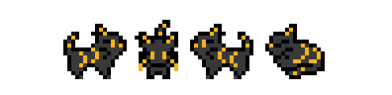

# 2024, March 18th

## Meaningful Decisions

For a while I've been stuck feeling like it wasn't worth investing time in new features,
considering how much work still needs to be done for the game's cutscenes.

My very hepful friend from the Roguelikes Discord server [Oneirical](https://oneirical.github.io)
gave me some simple feature recommendations recently:

> Healing items are a non-choice.
> You just use them when your inventory is full or when you can fit the whole heal value inside your HP bar.
> The additional effects, like removing bad statuses,
> is mostly irrelevant - just use the item when you receive the status.
> Suggestion: make it a real choice as to when to use the item.
> For example, instead of healing, it gives a slowly decaying "extra HP shield" for a limited time,
> which means it should be used in difficult encounters.

I'm not entirely sure about this one—
the game is designed to some extent around managing your HP and inventory.
If I were to make this change there'd need to be some alternative way to heal;
some amount being restored upon reaching an exit, like fatigue, would work.
Alternatively I could do a mix, with some items healing you and some giving a shield.
This misses the point to some extent, but would at least allow for more item variety.

> Levels are too big and sprawling with not much of interest.
> There are effectively two environment types: open space, and hallway.
> There is no incentive to look at the level layout as one of the tools in your toolbox.
> Suggestion: skills and abilities should make use of the environment.
> Knockback attack that pushes away 2 tiles and deals bonus damage if they hit a wall, for example.
> Frozen ramparts from dcss is a more complex example.

I started to realize the levels were a little bit too big when I looked to some other roguelikes
with much smaller level sizes.
64x64 wasn't necessarily the level size I thought would be best,
I was just trying to push it as far as I could in case it was ever necessary.
The widest dungeon type in the game, the bridge, is only 32 tiles across.
In fact, the bridge would probably look better if the map was limited to 32 tiles, too.

> Skills are too static and lack motion.
> Suggestion: an attack could make you "jump" over your foe and land behind them,
> or there could be a small dash attack that leaves you immobilized on the following turn.
> roguelikes are a positional puzzle first and foremost, and giving tools to reposition is how you expand strategy.
> bump attacking is mind numbing.

This is kind of an extension of the "knockback" move mentioned above.
These are all good ideas, and would go a long way in differentiating Luvui and Aris's movesets.
What's especially nice about movement moves is that I can put off adding projectiles to the game a little longer,
though maybe that's a bad thing :P

## Threaded evscript

I added two functions to my evscript interpreter earlier today: `spawn` and `join`;
These should make very complex overlapping movement a LOT easier.
Something that comes up a lot in scripts is the following:

```
// Move both characters at the same time, but slightly out of sync.
repeat 30 {
	move(PLAYER, RIGHT, 12); // Speed of 12; this is 0.75 tiles per frame.
}
repeat 30 {
	move(PLAYER, RIGHT, 12);
	move(PARTNER, RIGHT, 12);
}
repeat 30 {
	move(PARTNER, RIGHT, 12);
}
```

This is a simple example, but you can see how in a cutscene with 5 characters to manage
this can turn into a mess.

With `spawn` and `join`, you can create a thread for each character instead:

```
spawn(|| {
	repeat 60 {
		move(PLAYER, RIGHT, 12);
	}
});

spawn(|| {
	sleep(30);
	repeat 60 {
		move(PARTNER, RIGHT, 12);
	}
});

join();
```

The functions passed to `spawn` are not executed until `join` is called.
Join exexcutes each thread repeatedly until every single one of them returns.
If a child thread yields, join will yield as well and get executed on the next frame.

Once support for lambdas is added to evscript I'm hoping to make use of this in some the existing cutscenes.

# Bastet



This is probably my favorite character so far.
I intended for Sephone and Libera to have a child character to show that some of the animals in esprit
were forming families and settling down despite the strange world they're in.

In the original version of this cutscene, this character is called 'the baby',
and I never fleshed the idea out because the idea of esprit having literal babies felt wrong.
This world is foreign and strange and the rules these animals were used to don't apply.
That includes things like reproduction; there's no reason to assume that anyone can have children of their own.

Instead, Sephone and Libera have an adopted daughter: Bastet.
Sephone and Libera are both named after the greek (and roman) goddess, Persephone.
When I brought this up to Onei, he suggested egyptian gods, and brought up Bastet as an example.
This immediately gave me an idea for this character:
a former ruler, reduced to the role of a child.
The name doesn't have much signifigance other than her being a cat (making it a total of 5 cats!).
